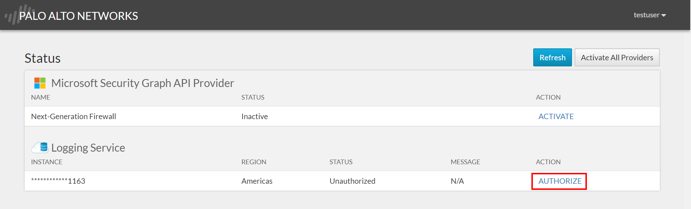

# Microsoft Graph Security API Provider

The Microsoft Graph Security API Provider is an App for Application Framework that enables customers and ISVs to programmatically view and query Security information (such as Alerts) stored in the Palo Alto Networks Logging Service. 

By enabling this integration, you can use the Microsoft Graph Security API (<https://www.microsoft.com/en-us/security/partnerships/graph-security-api>) as a single entry point to fetch security alerts from multiple Microsoft security products, as well as Palo Alto Networks Security Operating Platform, using a common schema.

For more information on Palo Alto Networks Application Framework, check out the product page: <https://www.paloaltonetworks.com/products/application-framework>

## Integration Requirements

### General Requirements

You need to have one instance of Logging Service configured on Palo Alto Networks, and you will only see alerts for the products or services connecting to Logging Service (ex. A Next-Generation Firewall or Global Protect Cloud Service).

**Note:** If you are using logging service for other products, but cannot send the alerts to the Intelligent Security Graph, please contact your account team and share this feedback.

**Note:** if you have multiple instances of Logging Service, only one will be used with the current integration.

### Permissions

Since this application enables communication between Application Framework and The Graph Security API, you will need accounts with the permissions described below.

#### Microsoft

Azure Active Directory is required, and the user that performs the Authorization flow must have the **Security Reader** *or* the **Security Administrator** role on the directory on which you want to activate the integration on, as shown below:

#### Palo Alto Networks

You need to have an account on Palo Alto Networks Support Portal (<https://support.paloaltonetworks.com>)

## Activation Instructions

1. Login to the Palo Alto Networks Cloud Services Portal at <https://apps.paloaltonetworks.com>:

2. Scroll down to the **Partners Apps on the Application Framework** section and look for the **Microsoft Graph Security API** App, and click on **Activate**:

3. Input the required parameters, and select the Logging Service Region and Instance you want to connect the Graph Security API Provider to, then click on **Agree and Activate**:

**Note:** Now that you have installed the App, you need to enable information to flow from the AppFramework to the Microsoft Intelligent Security Graph.

4. Wait until the Microsoft Graph Security API Application tile appears in the top section (Your Palo Alto Networks Cloud Services Apps). If the tile  is not clickable, wait for a few seconds and refresh the page if necessary. Then click on the App tile:

5. You will be redirected to the App UI where you will need to sign-in with your Microsoft Azure AD credentials:

6. The App will request for basic permissions, which are required to determine your user identity and perform the Authorization:

7. The page will display some Authorization and Activation options. If no buttons are available, it means that your user doesn't have the required permissions (Security Reader or Security Administrator) in Azure Active Directory. Authorize the App to access the Logging Service data on Palo Alto Networks Application Framework by clicking on **Authorize**:

8. A popup will appear, confirm by clicking on **Authorize**:

9. The *Request for Approval* page will show up. To grant the Security Graph API Provider access to your Logging Service instance on Application Framework, click on **Allow**:

The instance should show up as **Authorized**. If it shows *Authorizing*, wait a few seconds and click on *Refresh*. If it shows *Error*, you can try again.

10.  The last step is to enable the Microsoft Security Graph to send queries from your organization to the Security Graph API Provider for Application Framework. To do so, simply click the **Activate All Providers** button on the top right:

11. Check if the listed providers (Next-Generation Firewall is the only one available, others such as Traps will be available later) shown as **Active**.

**Congratulations!** You have completed the activation of the Microsoft Graph Security API Provider App for the Palo Alto Networks Application Framework (MGSAPAFTPANAF)

You can test if the integration is working correctly by logging on the Microsoft Security Graph test application: <https://isgapidemoui.azurewebsites.net> 

Login with the same user you used for the activation and try to **Get Alerts**:

**Note:** to see data, it is required to have Next-Generation Firewalls forwarding Threat logs to Logging Service, and have at least a threat event.

